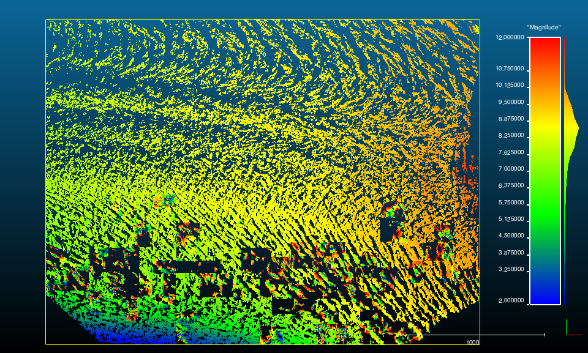

I've released a C++ library for running [Coherent Point Drift](https://sites.google.com/site/myronenko/research/cpd) on a set of points: https://github.com/gadomski/cpd.
I've also put together some basic [slides](/cpd-presentation/) describing the (very general) operation of the algorithm.

This library was developed initially to do change detection on high-temporal-resolution repeat terrestrial lidar scans of the [Helheim Glacier](http://en.wikipedia.org/wiki/Helheim_Glacier).
Like all glaciers, the Helheim Glacier deforms non-rigidly, and quantifying that non-rigid deformation (i.e. the spatially-varying surface velocities) of the glacier is important for many glaciological applications, including model initialization.

CPD is currently in a state where it works, but it has a lot of problems:

The above picture is a visualization of the magnitude of the velocity vectors at each point (units of meters per six hours, which was the time between scans).
Some of the current issues:

- We have to break the scan up into little chunks, since the CPD math chokes on big matrices of data
- Some of those chunks don't register well — that's those little flyaway portions in the bottom of the image
- The whole thing is single-threaded and slow — this run took thirty hours

However, these are definitely initial results, and I am hopeful we will be able to improve performance both in time and in supported data volumes.
Watch https://github.com/gadomski/cpd/releases for updates.
