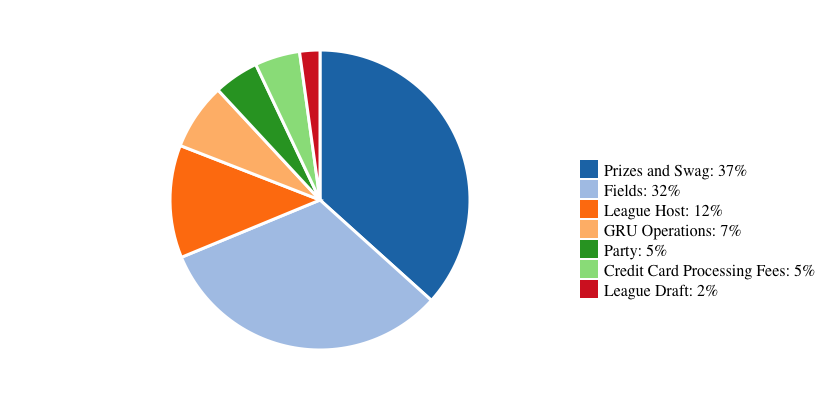

My [d3.js](http://d3js.org/) work trundled forward a bit today when I published [a simple visual summary of Grass Roots Ultimate's 2013 finances](http://gru.org/about/financials).
I began volunteering for GRU as their Treasurer earlier this year, and soon after coming on board I learned that the leadership wanted to publish their end-of-year profit and loss statements with some simple visualizations.
I volunteered to whip something together.

The code itself is nothing special, and is available [on Github](https://github.com/gadomski/gru.org-scripts/blob/master/contents/js/financials.js).
Since I had to integrate the visualizations into the [off-the-shelf CMS](http://ultimatecentral.com/) that drives our website, I couldn't create my whole visualization page from scratch, and so had to find another way to bring my d3 code over into the CMS-y page.
I ended up settling on a so-dumb-it-works system where [Github pages](http://gadomski.github.io/gru.org-scripts/js/financials.js) serves my javascript file to a simple script tag dropped into a "Raw HTML" CMS content block on my website.
A bit of manual styling, and *poof* we've got some d3 visualization inside a restrictive web environment.

If I were to do it again, I might consider forgoing any interactive elements and render out the d3 svgs into standalone files which could be included in the website.
However, this was a good exercise, and I do get the win of automatic chart updates with a simple push to `gh-pages`.
