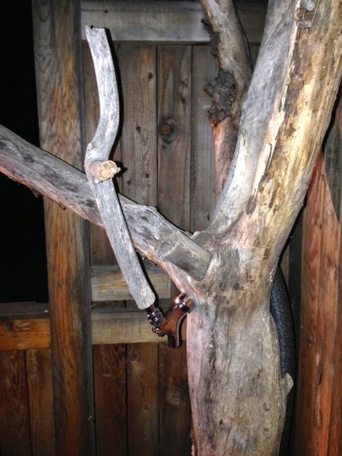

Beer.
On our patio.
Out of a tree.

Is it worth it?
Yes.
But is it *worth* it?
That's what we want to find out.

The visualizations below were all made with [d3.js](http://d3js.org/), and the code is available [on Github](https://github.com/gadomski/gadomski.github.io/tree/wintersmith/contents/js/the-beer-tree.js).

## Assumptions and Clarifications

- Keg deposits are not included in the cost of a keg, since that money is recouped.
- The cost of powering the refrigerator is considered to be 1/12th of the sticker "expected power consumption" of the refrigerator, applied at the end of each month.
- All fair market values are calculated by going to a liquor store and seeing how much of a given six pack cost, or sometimes just making up a number from memory.
